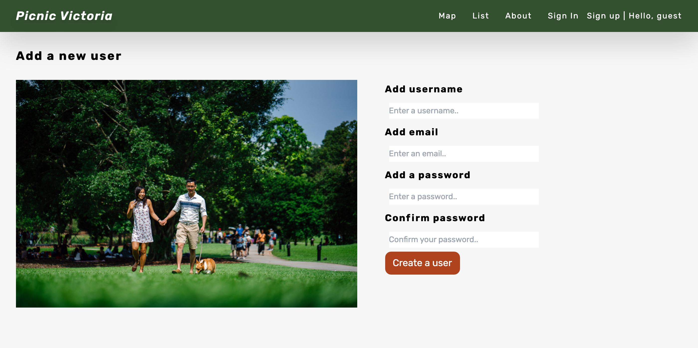
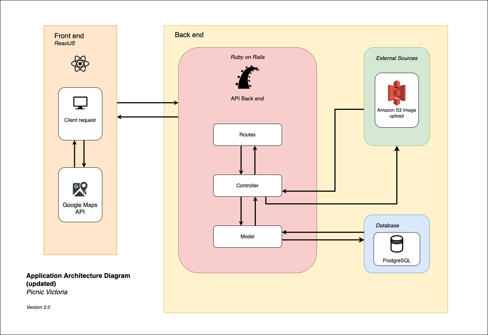
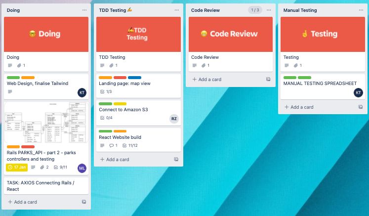

# **Picnic Victoria**

> _Nothing is better than a picnic in Vic!_

[Deployed Picnic Victoria App](https://picnic-vic.netlify.app/) | [PicnicVic Repo](https://github.com/PicnicVic) | [PicnicVic parks_react Repo](https://github.com/PicnicVic/parks_react) | [Parks Rails_API Repo](https://github.com/PicnicVic/Rails_API)

**ASSESSMENT:** Full Stack Application - Part B - for Coder Academy

[Past Assignment T3A2-A - Full Stack App (Part A) - documentation](https://github.com/PicnicVic/Main_T3A2-A)

See below for updates to the project Part A documentation.

[T3A2-B - Full Stack App (Part B) Deliverable - README.MD documentation](https://github.com/PicnicVic/.github)

---

**DEV TEAM:** Karla Tolentino, Ruilai Zhang, Matthew Liu, Bella Leber-Smeaton

**For:** Parks Victoria - Victorian State Government

**About:** Picnic Victoria is a React / Rails full-stack responsive web application, coupled with our Picnic Victoria inner city park registry API, ['Parks_API'](https://github.com/PicnicVic/Rails_API).
The 'Parks_API' populated with new park data is paired and marked up with the existing Google Maps API.

**Purpose:** In a world too familiar with the pandemic we now know more than ever that we need to connect with our friends and family, safely and in the real world outdoors.
_We need to utilise our green open spaces to enrich our lives._

To meet calls and pressure that local councils and the State Government aren't providing enough green space, Parks Victoria created Picnic Victoria, For small and large parks alike!

The Picnic Victoria app provides detailed park amenity information to help facilitate a family picnic to a skate park hangout.

Map View - Landing Page

List View

Park View

Admin View

About View

SignIn View

SignUp View

#### **User Testing:**

- User Admin
  Admin creating park
  
  Admin new Fawkner park in map marker
  
  New Park Details

- User Glenn B
   Found a park with a playground

#### **Testing Backend:**

#### **Testing Frontend:**

Testing the Landing Page Map View

#### **Manual Testing:**

[Manual Testing Spreadsheet](https://github.com/PicnicVic/parks_react/blob/dev/docs/manual_testing_spreadsheet.numbers)

(Example of Manual Testing Sheet located in [/docs](./docs/manual_testing_spreadsheet.numbers) folder.)

Final Manual Testing Sheet

# **T3A2-A Part A**

[REPO T3A2-A - Full Stack App (Part A)](https://github.com/PicnicVic/Main_T3A2-A)

# _New iterations of the documentation will be in italics_

#### **Functionality / Features:**

- Landing Page is the Map View: allows for instant viewing of proximity to parks.

  - Navigation Header allows to switch to List View - Has markers of park locations
  - Has model popups on click of park locations
  - Has drop down to select which type of park you want to select.
    

- List View: lists the entire of park markers in an informative readable listicle.

  - cards on click expand to show comments and any additional imagery if present.
  - Users can reply if logged in.
  - Authorisation will be requested.
  - Special Picnic Victoria feature is that users can pair a wine and or cheese with their park visit by clicking the randomise buttons. This shows the random options.
  - if logged in the user can also rate or make comments to the parks selected.
    
  - Authentication of login allows USERS to have access to RATING feature on Parks and COMMENTS w/ image upload feature.
    

- About View: gives details about what the app does, who it is by and why.
  - Other feature includes details about our Picnic Victoria partnership with wine and cheese producers.
    
- Sign In / Sign Up View: Allows Users and Admin to sign up and sign in.
  - User Sign up and Sign in allows for user authorisation, accessing certain features of the app such as star rating, park commenting and image upload.
  - Authentication for when users sign in includes, email as identifier, password, optional profile pic.
  - Authorisation occurs for features that have CRUD functionality for all users and admin. USers have access to only their commentary. Admin has access to ALL USERS CRUD functionality, including the ability to _hide_ or _delete_ posts that don't meet standard.  
    
    

_CHANGED FUNCTIONALITY of LANDING PAGE MAP VIEW, PART-B_

- We decided to utilise the Google Maps API instead of a static image with grid referencing the marker coordinate locations for parks. This allowed us to use the existing Google Map API data and their API information was easy to apply. This improves functionality by allowing someone else to manage the maps API and all we have to do is ensure that we manage it's dependencies and keep it updated.
- Removed the sort by Category due to time issues. Though _The next sprint_ would include ordering by category and searching for features to further allow users to access the amenities they specifically need.

_CHANGED READABILITY of LIST VIEW, PART-B_

- We ran out of time to apply certain sprinkle design elements such as the park icon and the rating system. _The next sprint_ would allow us to build out the design features to allow of different ways of reading what type of park it is, either bar

_NEW FUNCTIONALITY AND FEATURE for ADMIN, NEW PARK FORM, PART-B_

- Originally the database was to be already populated with park data so we did not consider adding a new park feature so an Admin could log in and add new ones with authorisation. It improves the ability to add new parks and in _The next sprint_ we would add other CRUD functionality such as UPDATE and DELETE.

#### **Target Audience:**

**Who:** The Novaks. 'The Nuclear Family, with dog'. Two parents. Two Children. One puppy.  
**Age:** Parents are late twenties to late thirties, 28-38. One child is of primary school age 7, and one two year old.  
**Occupation:** One stay at home parent, the other working 9-5. Children are young learners. 
**Nationality:** Slovenian Australians. 
**Income:** Lower middle Class, one income of 80k/annum.  
**Religion:** Non practicing/ 'lapsed Catholic'. 
**Location:** Local resident. Elsternwick, 3185. South-Eastern Suburbs.  
**Living circumstances:** Smaller townhouse with no garden. 
**What is the problem this Target Audience needs solving?** 
The Novaks have a young family and no backyard, so they spend a lot of their family time outside of the home to entertain their young children. They go for walks with their dog so they also need parks that allow for dogs and an off leash area. Picnics are a regular occurrence for the Novaks.  
As a family they have a lot of needs that have to be met for an enjoyable picnic. Their number 1 problem is that most parks near them don't have toilet / change table facilities and a playground. They wish they had the ability to look this up so they don't have to arrive disappointed.
Their ultimate park is one that has a toilet, cover from the sun, a playground and dog park. An 'all-in-one' park scenario. Their lower grade park might be one they take their dog to for a short morning walk.  

---

**Who:** Glenn B. Single male 
**Age:** 25 years old 
**Occupation:** Music teacher and support worker for special needs children. Living with another housemate 
**Nationality:** Australian 
**Income:** Lower middle class. Income approx. $50-60k per annum 
**Religion:** Agnostic 
**Location:** Werribee, 3030. Western Suburbs 
**Living circumstances:** Currently renting in a small unit and small backyard 
**What is the problem this Target Audience needs solving?** 
Glenn is a person in his mid 20s. With a small backyard at his rental, he will usually go out and explore the nearby park or reserve to get some fresh air. He is quite keen to visit and explore new places
 
The problem that Glenn have are two fold:  1. Finding the right park with right facilities. Many times, he has tried to find information on the a particular park, only to find that park does not have the correct facilities. Glenn has run into this problem many times, especially when it comes to working with special needs children, whereby the park does not have a playground or toilet facilities. 2. Finding a different variety of parks. As someone who loves exploring and as a special needs support worker, Glenn feel that some parks around his area are quite underwhelming, and would like to find a way to distinguish and filter out parks, based on what they have to offer.

---

 
**Who:** Henry Williams 
**Age:** 20 years old 
**Occupation:** Student 
**Nationality:** American 
**Income:** Part-time job 
**Religion:** Christian 
**Location:** New York, American 
**Living circumstances:** Currently live in a backpacker hotel 
**What is the problem this Target Audience needs solving?** 

1. Henry has very limited time in Melbourne, and he doesn't have much time to take the process of trial and error. 
2. Henry want to find parks that have good views and special architechture or hitorical statue etc. However, he don't have friends in melbourne to give him some valuable suggestions, his only option is google searching which is not convnient. 
    

---

 
**Who:** Ramona Rodriguez 
**Age:** 28 
**Occupation:** Graphic Designer 
**Nationality:** Australian/Mexican 
**Income:** $70,000 p.a. 
**Religion:** None 
**Location:** Fitzroy North 
**Living circumstances:** Sharehouse living with three other creatives 
**What is the problem this Target Audience needs solving?** 

1. Living in a sharehouse with three other people, Ramona would like to get out of the house and expand her social circle within the skateboarding or skating community.
2. Ramona is a busy person, so having an app that would give her quick and easy information on the types of skateparks available in her local vicinity would be ideal. As she is a budding skateboarder, Ramona would also like to share and find community reviews of the skateparks in her area. This is so she is able to organise meetups and learn with skaters of different backgrounds and experience.
    

---

#### **Tech Stack:**

| Application and Data | Utilities      | DevOps  | Business Tools |
| -------------------- | -------------- | ------- | -------------- |
| HTML 5               | Postman        | GitHub  | Trello         |
| CSS                  | JWT/Devise     | Git     | G Suite        |
| JavaScript ES6       | NPM            | VS Code | Discord        |
| Rails                | Ruby Gems      |         | Figma          |
| React                | - cancando gem |         | Google Fonts   |
| PostgreSQL           | RSPEC          |         | Zoom           |
| Amazon S3            | Jest           |         |                |
| Heroku               | Google API     |         |                |
| Netlify              |                |         |                |
|                      |                |         |                |

 

_UPDATED TECH STACK - PART-B_

| Application and Data | Utilities   | DevOps  | Business Tools |
| -------------------- | ----------- | ------- | -------------- |
| HTML 5               | JWT         | GitHub  | Trello         |
| CSS                  | NPM         | Git     | G Suite        |
| Tailwind             | Ruby        | VS Code | Discord        |
| JavaScript           | RSPEC       |         | Figma          |
| Rails                | Jest        |         | Google Fonts   |
| React.js             | Google API  |         | Notion         |
| PostgreSQL           | Rest Client |         |                |
| Amazon S3            |             |         |                |
| Heroku               |             |         |                |
| Netlify              |             |         |                |

_For full gem and npm package dependencies see associated README.md files for full list._

 

## **Dataflow Diagram:**

_UPDATED DATAFLOW DIAGRAM, PART-B_

- As the Amazon S3 Image hosting isn't hooked up to the comment section form for the user, we've removed it from this example of the Data flow diagram. _The next sprint_ would include us connecting the Amazon S3 image hosting so we could commit to the original dataflow diagram providing the user with image upload capacity.

## **Application Architecture Diagram:**

_UPDATED APP ARCHITECTURE DIAGRAM PART-B_

- The APIs for Cheese and Wine we had initially found were paid subscriptions. Whilst it is a feature for many users we found extracting wine and cheese dummy data from an array did the job of placeholder. _The next sprint_ would be building out an API that is specific for Victorian Wine and Cheese producers that also has location coordinates for stocklists near parks.

- The Amazon S3 Image upload is still in the App architecture diagram but not in it full use. The backend is connected to the AWS S3 buckets however we have yet to implement it into the React front-end for user icons/ user image upload / or park imagery. _The next sprint_ would be intergrating it into our forms and storing images into our Parks database associated with the user comments, user icons or specific parks.

## **Park Vic User Stories:**

The Novak Family:

- As **stay at home** mum Katja Novak, **I need an easy wine and cheese option** whilst I watch my children at the park, as **being a mum is hard work and I deserve a treat**.

- As **working dad** Phil Novak, I want to make sure my **park is the right type** and has **all the features I need** for my family, so I can ensure **family time is stress free** and **maximum time is spent together**.

- As an **everyday Mum** Katja Novak, I want to **offer commentary** across the platforms I use as a **‘mommy blogger’**, so I can **influence other mums** and they can **get the most from the app like me**.

Ramona Rodriguez:

- As **Ramona**, I want to be able to **review parks with skate features** and leave comments on it, so that I can **share this information** to other people in my **community**.

- As **Ramona**, I want to be able to **search for my nearest skatepark** on a map, so that I can **save time** between my busy schedule.

- As **Ramona**, I want to view different suggestions for **wine and cheese**, so that **I can organise social picnics** at the park with friends.

Glenn B:

- As a **support worker for special needs children**, I want to be able to **find a park nearby**, so that I can **keep children entertained**.

- As an **active person**, I want to be a able to **find and review** quality parks **with appropriate sporting facilities with up-to-date images**, so that I'm **not left disappointed**.

- As a **social person**, I want to be able to **find filter** for a park with **appropriate eating facilities**, so that I do not have to **waste time** driving around to find a park with the appropriate facilities.

Henry Williams:

- As a **backpacker**, I want to be able to **search for beautiful parks** with features that I am interested in, so that I can avoid visiting parks that have **nothing to attract me**.

- As a **backpacker**, I want to be able to find parks on the map with my **current location**, so that I can **save time** on searching because **local addresses make no sense to travelers**.

<!-- Show 2 versions of user stories 'shows evidence of user story revision and refinement' -->

## **Park Vic User Personas:**

### [Katja Novak](<https://www.figma.com/file/InWmz7kkpj2u7o86HhEdsl/User-personas-(Community)?node-id=0%3A1>)

### [Glenn B](https://www.figma.com/file/2DryqFWrEVPYJMFjB7luzn/A-user-persona?node-id=0%3A1)

### [Ramona Rodriguez](https://www.figma.com/file/dN11zwW6TYaPncwCPeT7pu/Skater-Girl-User-Story?node-id=0%3A1)

### [Henry Williams](https://www.figma.com/file/Ix0i5H4wdlQMbqRtiHGorb/User-personas---Henry-Williams?node-id=0%3A1)

## **Device Wireframes:**

### [Picnic Victoria Wireframe View](https://www.figma.com/file/1NgAVHDgzPuJq9B8WJswjZ/Wireframes?node-id=0%3A1)

Landing View

Landing View Zoomed with type of park selected

List View

List View Expanded with randomise wine and cheese picnic pairing and comments

List View Expanded with comment form and image upload

About View

Sign In View

Sign Up View

---

Landing view - Tablet

Hamburger menu - Tablet

List - Tablet

Comment on a park

Sign In - Tablet

Sign Up - Tablet

About - Tablet

---

Landing view - Mobile 
 
Hamburger menu - Mobile 
 
List - Mobile 
 
Comment on a park 

 
Sign In - Mobile 
 
Sign Up - Mobile 
 
About - Mobile 
 

---

Landing view - Fold Mobile  
 
Hamburger menu - Fold Mobile  
 
List - Fold Mobile  
 
Comment on a park - Fold Mobile  
 
Sign In - Fold Mobile  
 
Sign Up - Fold Mobile  
 
About - Fold Mobile  

 

_REMOVED PARTS OF THE WIREFRAMES - PART - B_

- Changes of colour on header and footer
- Removal of park icon and rating system
- Randomise Cheese and Wine buttons have just been hardcoded options paired with the specific park
- User Image Icons removed.
- Sorting by category on landing page has been removed as a sprinkle.

## **Project Management Part-A:**

Picnic Victoria chose a Kaban workflow management system as their chosen agile management style, specifically for it's simplified visualisation of the team work load.  

Individual developers manage their code and their workflow where it is _code reviewed_ before raising the pull request. This was specifically helpful in this documentation stage where all the team needs to be across the entire breadth of functionality and features.  

One thing that the team did not implement but will implement in Part B are deadlines on cards. Part A's due date was close enough and everyones social and work calendar too complicated to assign dates. The team worked together in a regard to not require such stringent reminders, but have assessed the need for it in Part B.

Kaban features include:

- Card rating system: low, medium, high.
- Adding members to cards.
  
- Watching necessary cards,
- Comments,
- attachments to ensure links to other softwares are easily accessible,
  
- Checklists: Completed/Code Reviewed/Raised Pull Request,
  

_UPDATED SCRUMBAN PROJECT MANAGEMENT PART-B + TEAM WORK_

[Picnic Victoria Trello Board](https://trello.com/b/FGsoaVLc/t3a2-part-b)

Scrumban methodology - utilising both Scrum and Kanban. Losing the complexity of Scrum and gaining its systematic approach, and gaining the strong visuals of Kanban.

- Added Requirements List to hold all rubric checklists.
- Project backlog to hold all of the parts and tasks before they were moved into the Sprint Backlog.
- Sprint Goals so there is a visual written indication for the theme of what's being worked on.

- Ready to start on the task from the Sprint Backlog? It was moved into the To-Do section and when finally 'started' moved into Started/Doing columns card columns depending on what stage we felt like it was at.

Trello sections to test, code review and manual test

Using Git to confirm when tasks are complete

- Loved working together as a team. The difficult thing was finding time between peoples work schedules and illness, allocating items that might be more suitable workload. For example, Karla was unwell so we all agreed that if she was able to, to work on something lighter such as implementing Tailwind and focusing on this CSS framework.

- When someone was working at their day/night job we provided them with tasks that were easier to complete, for example Bella being tasked to do the presentation and T3A2-B README.md document over the weekend she was working full time with less time able to dedicate to the keyboard.

- Matt and Ray worked great together working on the backend and so were often paired together sharing parts of features that were marked as difficult. Paired programming worked great for these harder features.

Team Work = Christmas get together at Holy Moly

 
